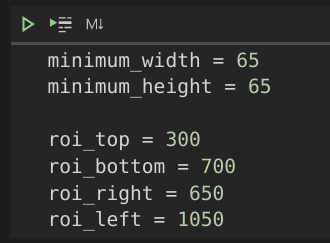

# This application was developed to detect cars from a video captured by a camera in a highway

## Results of the the application using OpenCV

 
This project contains a region of interest where the cars are being detected.

 
 

# OpenCV #

OpenCV (Open Source Computer Vision Library) is a library of programming functions mainly aimed at real-time computer vision. Originally developed by Intel, it was later supported by Willow Garage then Itseez (which was later acquired by Intel).

### Resources

* Homepage: <https://opencv.org>
  * Courses: <https://opencv.org/courses>
* Docs: <https://docs.opencv.org/master/>
* Q&A forum: <https://forum.opencv.org>
  * previous forum (read only): <http://answers.opencv.org>
* Issue tracking: <https://github.com/opencv/opencv/issues>
* Additional OpenCV functionality: <https://github.com/opencv/opencv_contrib> 

### Contributing

Please read the [contribution guidelines](https://github.com/opencv/opencv/wiki/How_to_contribute) before starting work on a pull request.

#### Summary of the guidelines:

* One pull request per issue;
* Choose the right base branch;
* Include tests and documentation;
* Clean up "oops" commits before submitting;
* Follow the [coding style guide](https://github.com/opencv/opencv/wiki/Coding_Style_Guide).

___
Requirements:

- OpenCV `pip install opencv-python`
- Numpy `pip install numpy`
- Contrib `pip install opencv-contrib-python`
___

The region of interest can be defined changing the values of the bottom, top, left and right. The reference (0,0) is the upper left corner.

The script has a small problem in the end but even though the result can be saved.
___

 
In case of any questions, please contact me: edson.costa@hotmail.com